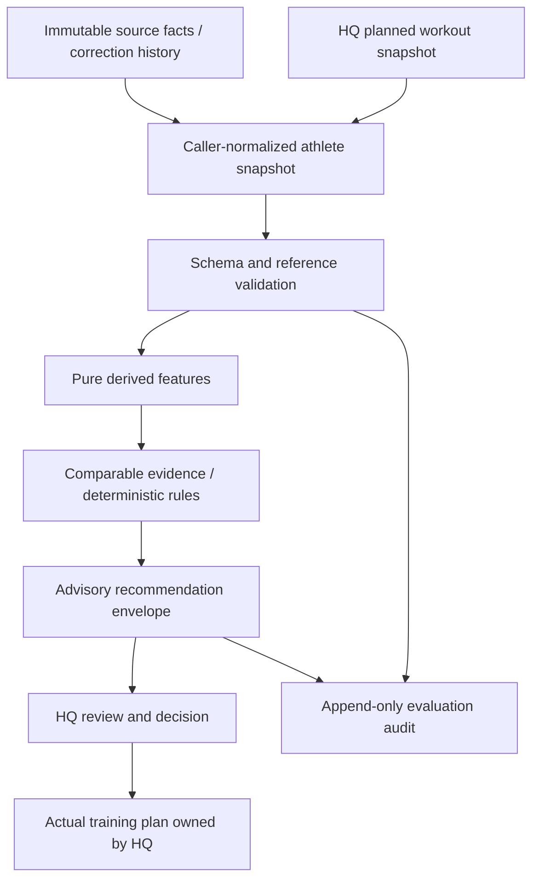

# Architecture v0.1

There is no engine-to-plan edge. The engine does not receive plan credentials,
a plan repository interface, or a write callback. `hq_envelope` rejects extra
fields, unknown states, approval bypass and authority escalation. External HQ
must still enforce its own identity, authorization, stale-version and approval
checks; JSON fields are not authentication.

## Data separation

1. Source facts preserve original payloads and provenance. Payloads are opaque;
   the engine does not infer or execute instructions from them.
2. Athlete data is an explicit normalized snapshot, referencing source fact IDs.
   Normalization is supplied by a trusted caller in v0.1, not guessed by an LLM.
3. Derived features are recalculated from validated normalized data.
4. Recommendations reference evidence and contain no executable plan change.

The engine checks athlete/session identity, unique IDs, workout/sport alignment,
finite numeric values, interval dose consistency, chronology, source references
and correction chains. Recovery fields require enough elapsed time since the
actual workout ended. Downstream quality requires an actual linked next session
completed before the response was recorded. An input snapshot contains one
athlete; mixed athletes are rejected.

Schemas cannot establish that a device or report is truthful. The caller owns
source authentication, correct normalization, and data consent. Original source
payloads are stored separately from interpreted normalized records; v0.1 does
not verify arbitrary device payloads against those records.

## Reproducibility

`evaluate` is pure: it copies inputs, uses explicit `as_of`, sorts collections,
and neither reads a clock nor makes network requests. Exact dose keys use
structural equality (60 and 60.0 are equivalent). Evidence and source reference order is stable. An input hash,
engine version, taxonomy version and policy version accompany every result.
Timestamps must include a timezone. Source facts and observations after `as_of`
are rejected, preventing future observation leakage. Future planned snapshots
are permitted because they are HQ-authored candidates, not observations.

Session, dose-pattern, and policy authority are distinct. Per-session features
describe observations. Repeated comparable observations support a dose-pattern
summary. HQ alone decides whether any signal becomes planning policy.

## Audit and corrections

`AuditLog` stores the full request and exact recommendation as a new event. It
re-evaluates before insertion, uses a transaction with a SQLite write lock,
and hashes each event with the previous hash. SQLite triggers reject ordinary
UPDATE/DELETE operations. Replay verifies both chain integrity and output.

This is local append-only history, not a cryptographically trusted ledger: a
database owner can remove triggers, replace the whole database or truncate a
suffix. External signed checkpoints/backups would be needed to detect those
attacks. Full snapshots favor explainability over storage efficiency in v0.1.
SQLite is intended for one local host, not a shared network database.

A correction is a new `CORRECTION` source fact with a newer timestamp and
`supersedes` reference. Forked, cyclic, absent and stale correction references
are rejected. Normalized records must use the current source fact. Corrections
never silently modify earlier snapshots or results. Re-evaluate the corrected
snapshot and append it as another event.

## Extension points

Add tested device-specific adapters before raw-data automation. Candidate
ranking should return proposals through the same HQ review boundary. New
features need explicit units and enough raw measurements. Evaluate any future
ML against this versioned baseline on held-out athlete data before adoption.

## V1 application extension
The v0.1 engine remains version-frozen. See [v1 architecture](v1-architecture.md) for the local application, journal, proposal compiler and separate HQ writer.

